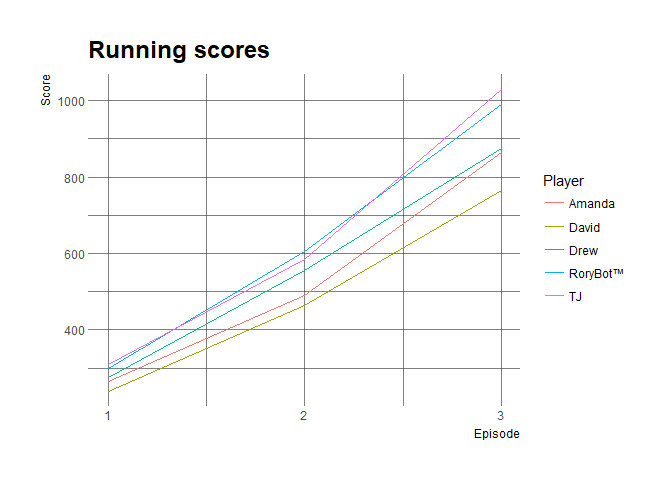
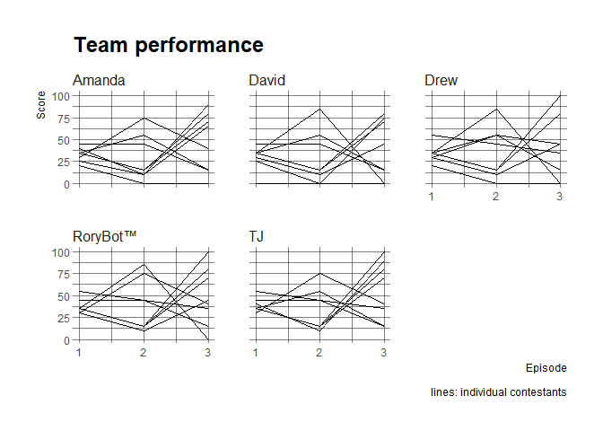

Bachelorette Fantasy League :rose:
================

Get the data
------------

Connect to Google Sheets and download the team rosters and the scores.

``` r
# Private file where I store the sheet-key 
source("sheet-key.R")
sheet <- googlesheets::gs_key(sheet_key)
teams <- googlesheets::gs_read_csv(sheet, "League Member Teams")
teams
#> # A tibble: 31 x 6
#>    Contestant  Drew David Amanda    TJ `RoryBot™`
#>         <chr> <chr> <chr>  <chr> <chr>      <chr>
#>  1       Adam  <NA>  <NA>   <NA>  <NA>       <NA>
#>  2       Alex     x  <NA>   <NA>     x          x
#>  3    Anthony  <NA>  <NA>   <NA>  <NA>       <NA>
#>  4   Blake E.  <NA>     x      x     x          x
#>  5   Blake K.  <NA>  <NA>   <NA>  <NA>       <NA>
#>  6      Brady  <NA>     x   <NA>  <NA>       <NA>
#>  7      Bryan  <NA>  <NA>   <NA>  <NA>       <NA>
#>  8      Bryce  <NA>  <NA>   <NA>  <NA>       <NA>
#>  9       Dean     x  <NA>   <NA>  <NA>       <NA>
#> 10    DeMario     x     x   <NA>  <NA>          x
#> # ... with 21 more rows

scores <- googlesheets::gs_read_csv(sheet, "Contestant Scores")
scores
#> # A tibble: 31 x 13
#>    Contestant   Ep1   Ep2   Ep3   Ep4   Ep5   Ep6   Ep7   Ep8   Ep9  Ep10
#>         <chr> <int> <int> <int> <lgl> <lgl> <lgl> <lgl> <lgl> <lgl> <lgl>
#>  1       Adam    25    10    70    NA    NA    NA    NA    NA    NA    NA
#>  2       Alex    35    15   100    NA    NA    NA    NA    NA    NA    NA
#>  3    Anthony    25     0    85    NA    NA    NA    NA    NA    NA    NA
#>  4   Blake E.    45    45    15    NA    NA    NA    NA    NA    NA    NA
#>  5   Blake K.     0     0    NA    NA    NA    NA    NA    NA    NA    NA
#>  6      Brady    25     0    75    NA    NA    NA    NA    NA    NA    NA
#>  7      Bryan    50    10    65    NA    NA    NA    NA    NA    NA    NA
#>  8      Bryce    30     0    75    NA    NA    NA    NA    NA    NA    NA
#>  9       Dean    30    55    45    NA    NA    NA    NA    NA    NA    NA
#> 10    DeMario    35    85    NA    NA    NA    NA    NA    NA    NA    NA
#> # ... with 21 more rows, and 2 more variables: Ep11 <lgl>, `Season
#> #   Total` <int>
```

Create some mock data to prototype for future plots.

``` r
# scores$Ep2 <- sample(scores$Ep1, replace = TRUE)
# scores$Ep3 <- sample(scores$Ep2, replace = TRUE)
```

Clean the scores into a long-format table.

``` r
library(tidyverse)

scores_long <- scores %>% 
  select(Contestant, starts_with("Ep")) %>% 
  # Remove weeks without scores
  select_if(function(xs) !all(is.na(xs))) %>% 
  # Convert to long format
  gather(Episode, Score, -Contestant) %>% 
  # Extract the number from the episode
  extract(Episode, into = c("Episode"), regex = "(\\d+)", convert = TRUE) %>% 
  # Replace NAs with 0s
  replace_na(replace = list(Score = 0))

# Add cumulative scores for each contestant
scores_long <- scores_long %>% 
  arrange(Contestant, Episode) %>% 
  group_by(Contestant) %>% 
  mutate(RunningScore = cumsum(Score)) %>% 
  ungroup()
```

Create a long-format table of the rosters.

``` r
teams_long <- teams %>% 
  gather(Player, OnTeam, -Contestant) %>% 
  filter(!is.na(OnTeam)) %>% 
  select(Player, Contestant)
teams_long
#> # A tibble: 40 x 2
#>    Player Contestant
#>     <chr>      <chr>
#>  1   Drew       Alex
#>  2   Drew       Dean
#>  3   Drew    DeMario
#>  4   Drew      Diggy
#>  5   Drew     Josiah
#>  6   Drew      Kenny
#>  7   Drew      Lucas
#>  8   Drew      Mohit
#>  9  David   Blake E.
#> 10  David      Brady
#> # ... with 30 more rows
```

Combine the rosters and the scores.

``` r
league <- inner_join(teams_long, scores_long, by = "Contestant")
league_sums <- league %>% 
  group_by(Player, Episode) %>% 
  summarise(Score = sum(RunningScore))
```

Plots
-----

``` r
library(hrbrthemes)

ggplot(league_sums) + 
  aes(x = Episode, y = Score, color = Player) + 
  geom_line() + 
  theme_ipsum_rc() + 
  scale_x_continuous(breaks = seq_len(max(league$Episode))) +
  labs(title = "Running scores")
```



``` r

knitr::kable(league_sums)
```

| Player   |  Episode|  Score|
|:---------|--------:|------:|
| Amanda   |        1|    265|
| Amanda   |        2|    490|
| Amanda   |        3|    865|
| David    |        1|    240|
| David    |        2|    465|
| David    |        3|    765|
| Drew     |        1|    275|
| Drew     |        2|    555|
| Drew     |        3|    875|
| RoryBot™ |        1|    300|
| RoryBot™ |        2|    605|
| RoryBot™ |        3|    990|
| TJ       |        1|    310|
| TJ       |        2|    585|
| TJ       |        3|   1030|

``` r

ggplot(league) + 
  aes(x = Episode, y = Score, group = Contestant) + 
  geom_line() + 
  facet_wrap("Player") +
  theme_ipsum_rc() + 
  labs(title = "Team performance", caption = "lines: individual contestants") +
  scale_x_continuous(breaks = seq_len(max(league$Episode)))
```


